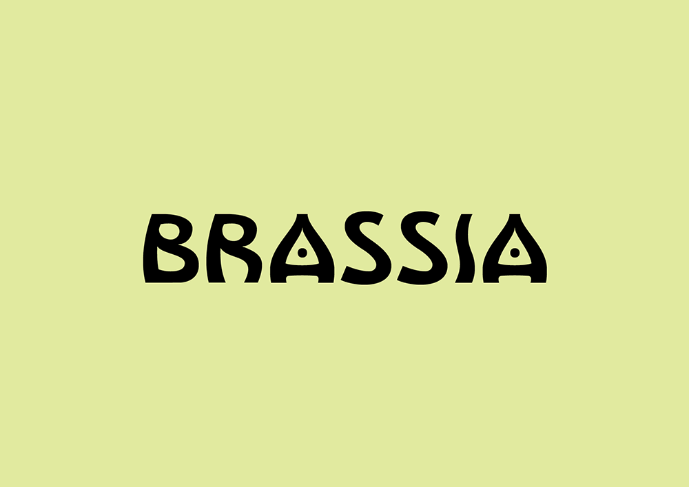
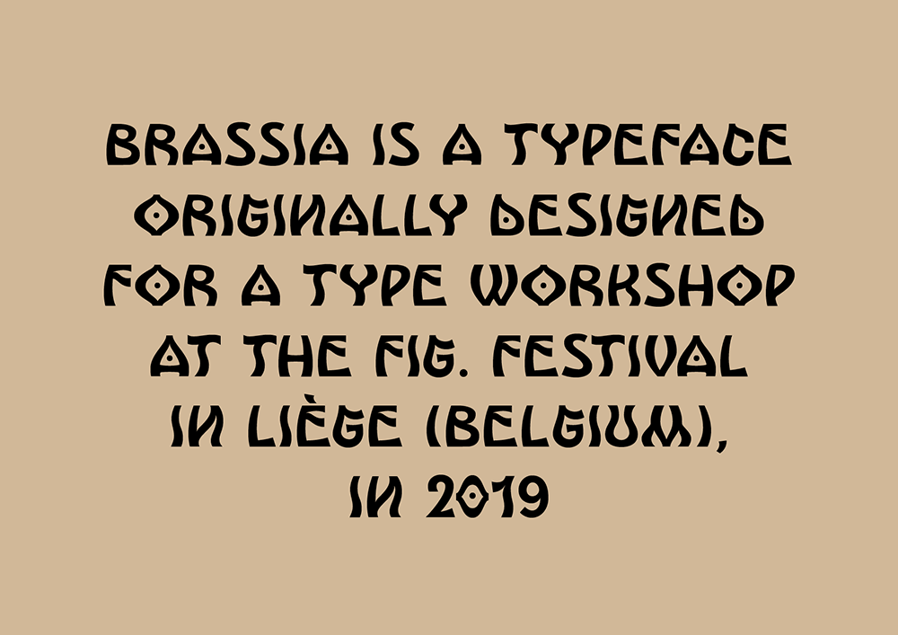
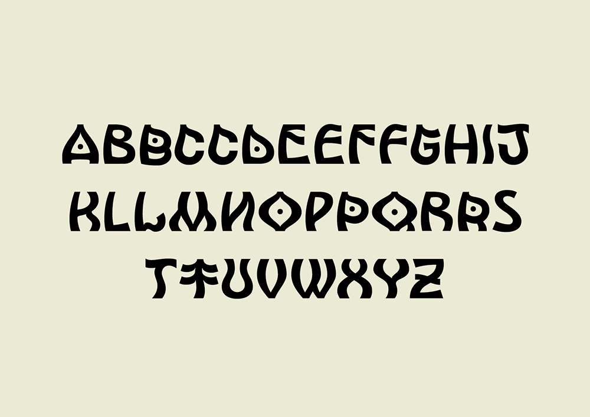

# Brassia

<strong>[EN]</strong> 

Brassia is a typeface that was originally designed for teaching vector tracing. It was first prototyped during a workshop organized by the Velvetyne Type Foundry for the Fig. festival in Liège (Belgium), that took place in february 2019.

Brassia's design is inspired by Solarpunk, a science fiction genre that looks towards a brighter future based on clean energy production, usually with a distinctive art-nouveau aesthetic. Its letters were drawn by taking a freestyle approach to the latin alphabet, with multiple influences from many sources.

<strong>[FR]</strong> 

Brassia est une fonte typographique qui avait été conçue initialement pour l’enseignement du traçage vectoriel. Elle a été prototypée pour la première fois lors d’un atelier de création de caractères organisé par Velvetyne Type Foundry pour le festival Fig. de Liège (Belgique), qui s’est déroulé en février 2019.

Le design de Brassia est inspiré du Solarpunk, un genre de science-fiction qui se tourne vers un avenir plus brillant, basé sur la production d’énergie propre, généralement avec une esthétique art nouveau. Ses lettres ont été dessinées comme une interprétation décomplexée de l’alphabet latin, avec des influences multiples.

<strong>[ES]</strong> 

Brassia es un tipo de letra que fue diseñado originalmente para  enseñar el trazado de vectores. Fue prototipado durante un taller de diseño tipográfico organizado por Velvetyne Type Foundry para el festival Fig. en Lieja (Bélgica), que tuvo lugar en febrero de 2019.

El  diseño de Brassia está inspirado en el Solarpunk, un género de ciencia  ficción que imagina un futuro más brillante basado en la producción de  energía limpia, generalmente con una estética art nouveau. Sus letras  fueron dibujadas como una interpretación libre del alfabeto latino, mezclando formas de orígenes y estilos muy diversos.

## Specimen

## License

Brassia is licensed under the SIL Open Font License, Version 1.1.
This license is copied below, and is also available with a FAQ at
http://scripts.sil.org/OFL

## Repository Layout

This font repository follows the Unified Font Repository v2.0,
a standard way to organize font project source files. Learn more at
https://github.com/unified-font-repository/Unified-Font-Repository
